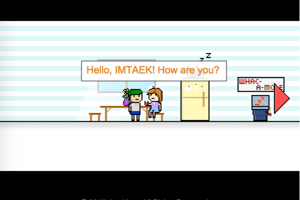
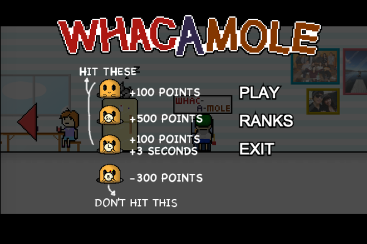
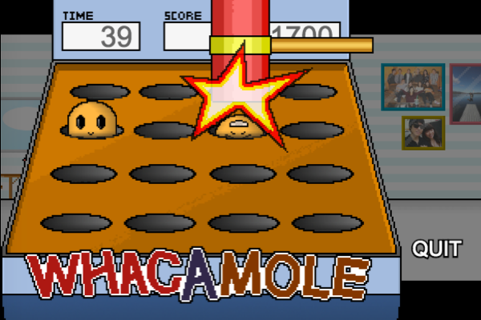

#HelloWorld!

 
##Welcome to HelloWorld!

 

HelloWorld! is my game portfolio interface. Click to move your character and see my games
 
Since it's using PHP and MySQL, please visit [http://ianh.co.nf](http://ianh.co.nf) to see the full features. 

 
---

##Game 1 : Wrack-a-mole

 
 

###Features
- 60 seconds for hitting moles.
- Game speed goes up as time goes.
- 3 special moles : x5 point, +3 sec and -point(-300 point) moles.
- Saves high scores in the database to see my rank and others score.

 
---

##Game 2 : Bubble

 
 

###Single Play features
- you have 60 seconds.
- adds new line of bubbles after every certain turns.
- 1 special bubble : bomb bubble.
- 1 obstacle bubble adds randomly at the beginning of your turn.
- Saves high scores in the database to see my rank and others score.
- game over when bubbles goes over the border.

 

###Bettle Mode features
- game over when bubble hit the ground.
- adds new line of bubbles after every certain turns.
- 2 special bubbles : bomb bubble and horizontal color changing bubble.
- obstacle bubble adds to the opponent when you pop more than 5 bubbles.
- you lose when bubbles goes over your side border.

 
---
